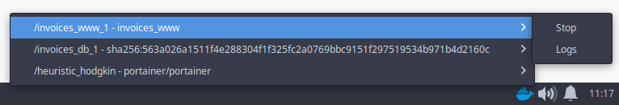

# Docker Tray
A cross-platform tray icon for Docker. Stop containers and view their log easily.



## Install
* [Linux Download](https://github.com/marcocastignoli/docker-tray/releases/download/1.0.0/docker-tray-1.0.0.AppImage) 
* Windows Download (Coming soon)
* MacOS Download (Coming soon)

## Contribute

### Install dependencies
```npm i```

### Develop
```npm start```

### Building
```npm run build```